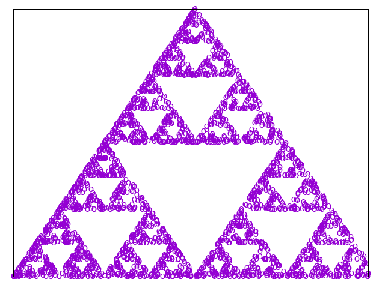

The following is a port of
[sierpinski.dx](https://google-research.github.io/dex-lang/examples/sierpinski.html)
and is fairly straightforward.

```futhark
import "dex-prelude"

type Point = (f64, f64)

let update [n] (points: [n]Point) (key: Key) ((x,y): Point) : Point =
  let (x', y') = points[randIdx n key]
  in (0.5 * (x + x'), 0.5 * (y + y'))

let runChain 'a (n: i64) (f: Key -> a -> a) (key: Key) (x0: a) : [n]a =
  scan' n x0 (many f key)

let trianglePoints : [3]Point =
  [(0.0, 0.0), (1.0, 0.0), (0.5, f64.sqrt 0.75)]

let points = unzip (runChain 3000 (update trianglePoints) (newKey 0) (0.0, 0.0))
```

Let's give it a point plot.

```
> :gnuplot {points=points};
unset xtics
unset ytics
plot points with points pt "o" notitle
```




