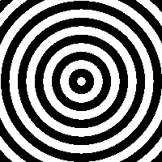
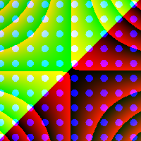
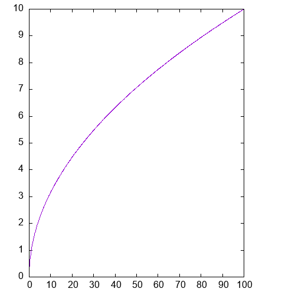
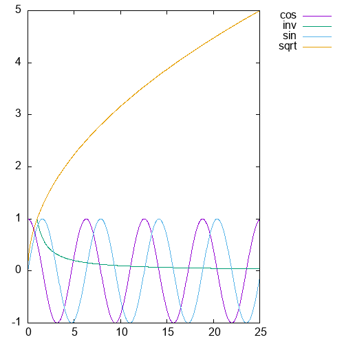
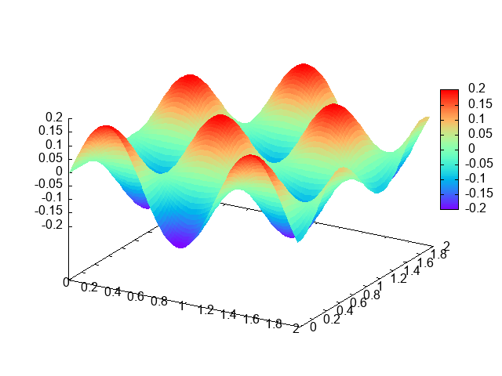

The ``futhark literate`` command translates Futhark programs to
Markdown files.  Specially formatted comments, called *directives*,
are replaced with executing parts of the program.  The purpose of
literate Futhark is to write small example
programs with quick visualisations and such.

For example, let us define a function for generating a linearly
spaced vector:

```futhark
let linspace (n: i64) (start: f64) (end: f64) : [n]f64 =
  tabulate n (\i -> start + f64.i64 i * ((end-start)/f64.i64 n))
```

With an evaluation directive, we can show what it evaluates to:

```
> linspace 10i64 0.0f64 10.0f64
```

```
[0.0f64, 1.0f64, 2.0f64, 3.0f64, 4.0f64, 5.0f64, 6.0f64, 7.0f64, 8.0f64, 9.0f64]
```


```
> linspace 10i64 5.0f64 10.0f64
```

```
[5.0f64, 5.5f64, 6.0f64, 6.5f64, 7.0f64, 7.5f64, 8.0f64, 8.5f64, 9.0f64, 9.5f64]
```


If you look at the [source file](literate-basics.fut), you'll see
that that the results are not part of what I wrote.  Those are
automatically inserted by ``futhark literate``.

The expressions in the directives are not full Futhark expressions.
Rather, they are written in a tiny subset called FutharkScript,
which supports little besides calling top-level functions in the
literate file.  An important restriction is that all numeric literals
must have a type suffix, as above.  When we write literate files, we
must put all nontrivial code in ordinary Futhark definitions, which
support the full language.  The Futhark part of a a literate Futhark program is
compiled like an ordinary Futhark program.

Some values are boring when viewed as arrays of numbers.

```futhark
let linspace_2d n start end : [n][n](f64,f64) =
  map (\x -> map (\y -> (x,y)) (linspace n start end))
      (linspace n start end)

let spirals n v : [n][n]f64 =
  let f (x, y) =
    f64.sgn (f64.cos (f64.sqrt (x**2+y**2)))
  in map (map f) (linspace_2d n (-v) v)
```

For expressions with an appropriate type, ``futhark literate`` can
convert them to an image:

```
> :img spirals 200i64 30.0f64
```





Two-dimensional arrays of floats are interpreted as greyscale.  A
two-dimensional array of 32-bit integers is interpreted in RGB
format.

```futhark
let colours n v : [n][n]u32 =
  let f (x, y) =
    (u32.f64 (x*y) & 0xFF) << 16 |
    (u32.f64 (x+y) & 0xFF) << 8 |
    (u32.f64 (f64.cos x-f64.sin y) & 0xFF)
  in map (map f) (linspace_2d n (-v) v)
```

This is more colourful.

```
> :img colours 200i64 30.0f64
```





Using the `:img` directive, we can draw whatever we want.
However, if we just want to plot the value of some function, it
would be pretty awkward to implement graphing every time.

```futhark
let xys f n start end : ([n]f64, [n]f64) =
  unzip (map (\x -> (x, f x)) (linspace n start end))

let plot_sqrt = xys f64.sqrt
let plot_sin = xys f64.sin
let plot_cos = xys f64.cos
let plot_inv = xys (1/)
```

The `:plot2d` directive lets us to a quick plot of pairs of *x* and
*y* value arrays.

```
> :plot2d plot_sqrt 1000i64 0.0f64 100.0f64
```





And if we want multiple plots in the same graph, then we pass a
record of such pairs.

```
> :plot2d {sqrt=plot_sqrt 1000i64 0.0f64 25.0f64,
           sin=plot_sin 1000i64 0.0f64 25.0f64,
           cos=plot_cos 1000i64 0.0f64 25.0f64,
           inv=plot_inv 1000i64 1.0f64 25.0f64}
```





The `:plot2d` directive shells out to
[Gnuplot](http://www.gnuplot.info/).  For advanced needs, such as
3D plotting, we can write the Gnuplot commands ourselves.

```futhark
let plot3d n start end : ([]f64, []f64, []f64) =
  let f (x, y) =
    let z = f64.sin(5*x) *f64.cos(5*y)/5
    in (x, y, z)
  in unzip3 (flatten (map (map f) (linspace_2d n start end)))
```

We pass in the data as a a record, and each field becomes a Gnuplot
variable that contains the name of a data file.

```
> :gnuplot {ourdata=plot3d 100i64 0.0f64 2.0f64};
set palette rgbformulae 33,13,10
set dgrid3d 100,100
splot ourdata u 1:2:3 with pm3d notitle
```




